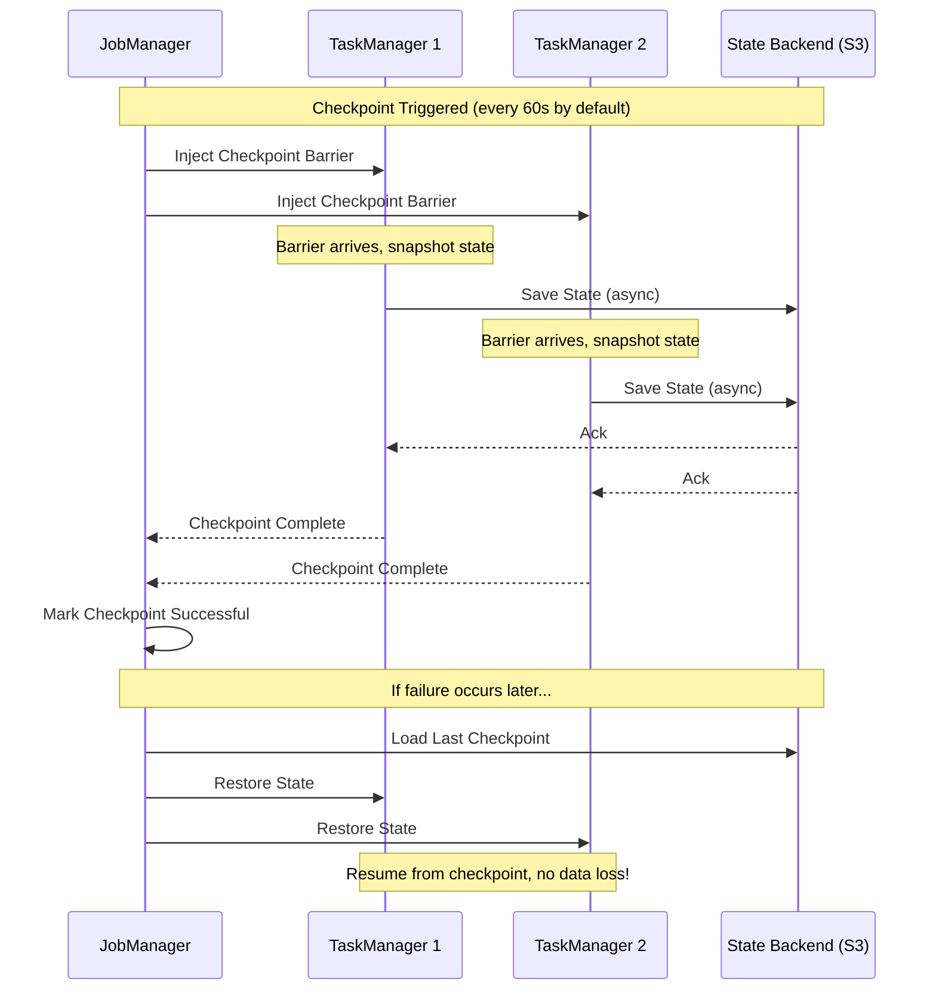

# Apache Flink Operational Essentials

## Table of Contents

1. [What is Apache Flink?](#what-is-apache-flink)
2. [Core Concepts](#core-concepts)
3. [Flink Architecture](#flink-architecture)
4. [Running Flink on Kubernetes](#running-flink-on-kubernetes)
5. [How Data Flows Through Flink](#how-data-flows-through-flink)
6. [State Management & Fault Tolerance](#state-management--fault-tolerance)
7. [Monitoring & Observability](#monitoring--observability)
8. [Getting Started](#getting-started)
9. [Advanced Topics](#advanced-topics)
10. [Additional Resources](#additional-resources)

---

## What is Apache Flink?

Apache Flink is a **distributed stream processing framework** that processes data in real-time as it arrives, rather than waiting to collect batches of data first.

### Why Flink?

Think of data processing approaches on a spectrum:

```
Traditional Batch Processing          Stream Processing (Flink)
────────────────────────────────────────────────────────────────►

"Wait for all data,                  "Process each event
 then process together"               as it arrives"

Example: Daily reports               Example: Real-time fraud detection
Latency: Hours                       Latency: Milliseconds
```

**Key Benefits:**
- **Low Latency**: Process events in milliseconds, not hours
- **Exactly-Once Semantics**: Guarantees no data loss or duplication, even during failures
- **Stateful Processing**: Remember information across events (e.g., "how many purchases has this user made?")
- **Scalability**: Handle millions of events per second across distributed clusters

### When to Use Flink?

| Use Case | Example |
|----------|---------|
| Real-time analytics | Dashboard showing live transaction volumes |
| Fraud detection | Block suspicious transactions as they happen |
| Event-driven apps | Send notifications when inventory drops below threshold |
| ETL pipelines | Transform and load data from Kafka to data warehouse |
| Machine learning | Real-time feature computation and model inference |

---

## Core Concepts

Before diving into architecture, let's understand the fundamental concepts.

### Streams: Bounded vs Unbounded

```
Unbounded Stream (Infinite)               Bounded Stream (Finite)
────────────────────────────────►         ┌─────────────────────┐
Events continuously arriving              │ Fixed dataset       │
No defined end                            │ Has start and end   │
                                          └─────────────────────┘
Examples:                                 Examples:
- Kafka topic                             - CSV file
- User clicks                             - Database table
- Sensor readings                         - Log file from yesterday
```

**Key insight**: Flink treats everything as a stream. A bounded stream is just a stream that ends.

### Operators: Building Blocks of Data Processing

Operators transform data. They chain together to form a processing pipeline:

```
┌─────────┐    ┌─────────┐    ┌─────────┐    ┌─────────┐    ┌─────────┐
│ Source  │───►│  Map    │───►│ Filter  │───►│ KeyBy   │───►│  Sink   │
│ (Kafka) │    │(enrich) │    │(valid?) │    │(group)  │    │ (DB)    │
└─────────┘    └─────────┘    └─────────┘    └─────────┘    └─────────┘
```

Common operators:
- **Source**: Reads data (Kafka, files, databases)
- **Map**: Transform one event to one event (1:1)
- **FlatMap**: Transform one event to zero or more events (1:N)
- **Filter**: Keep only events matching a condition
- **KeyBy**: Group events by a key (required before aggregations)
- **Window**: Group events by time (e.g., "every 5 minutes")
- **Reduce/Aggregate**: Combine events (sum, count, average)
- **Sink**: Write results (Kafka, files, databases)

### State: Remembering Across Events

**Stateless processing**: Each event processed independently
```
Input: [1, 2, 3, 4, 5]
Map(x => x * 2)
Output: [2, 4, 6, 8, 10]   # Each input produces one output, no memory needed
```

**Stateful processing**: Processing depends on previous events
```
Input: [1, 2, 3, 4, 5]
Running Sum
Output: [1, 3, 6, 10, 15]   # Need to remember the running total
```

**Why state matters**: Real applications need state - counting users, tracking sessions, detecting patterns over time.

### Parallelism: Processing at Scale

Flink distributes work across multiple parallel instances:

```
                    Parallelism = 4

Source Partition 1 ──► Map Instance 1 ──► Sink Instance 1
Source Partition 2 ──► Map Instance 2 ──► Sink Instance 2
Source Partition 3 ──► Map Instance 3 ──► Sink Instance 3
Source Partition 4 ──► Map Instance 4 ──► Sink Instance 4
```

**Key insight**: Higher parallelism = more throughput (up to a point)

---

## Flink Architecture

### The Big Picture

Flink uses a **master-worker architecture**:

```mermaid
graph TB
    subgraph "You (Developer)"
        Client["💻 Client<br/>Your Application Code"]
    end

    subgraph "Control Plane (The Brain)"
        JM["🧠 JobManager<br/>Coordinates everything"]
        RM["📦 ResourceManager<br/>Manages workers"]
        Dispatcher["🚪 Dispatcher<br/>Entry point & Web UI"]
    end

    subgraph "Data Plane (The Workers)"
        TM1["⚙️ TaskManager 1"]
        TM2["⚙️ TaskManager 2"]
        TM3["⚙️ TaskManager 3"]
    end

    subgraph "External Systems"
        Source["📥 Source<br/>(Kafka, etc.)"]
        Sink["📤 Sink<br/>(Database, etc.)"]
        State["💾 State Backend<br/>(S3, RocksDB)"]
    end

    Client -->|"1. Submit Job"| Dispatcher
    Dispatcher -->|"2. Start Job"| JM
    JM -->|"3. Request Workers"| RM
    RM -->|"4. Create/Assign"| TM1
    RM -->|"4. Create/Assign"| TM2
    RM -->|"4. Create/Assign"| TM3

    JM -->|"5. Distribute Tasks"| TM1
    JM -->|"5. Distribute Tasks"| TM2
    JM -->|"5. Distribute Tasks"| TM3

    Source --> TM1
    Source --> TM2
    Source --> TM3

    TM1 --> Sink
    TM2 --> Sink
    TM3 --> Sink

    TM1 -.->|"Checkpoint"| State
    TM2 -.->|"Checkpoint"| State
    TM3 -.->|"Checkpoint"| State
```



### Component Breakdown

#### JobManager (The Coordinator)
The **brain** of a Flink cluster:
- Receives your job and creates an execution plan
- Decides which TaskManager runs which task
- Coordinates checkpoints for fault tolerance
- Handles failures and restarts

**Analogy**: Like a construction foreman who reads blueprints and assigns workers to tasks.

#### TaskManager (The Worker)
The **muscle** that does actual data processing:
- Runs your operators (map, filter, aggregate, etc.)
- Manages local state
- Exchanges data with other TaskManagers
- Reports status to JobManager

**Analogy**: Like construction workers who do the actual building.

#### Task Slots (Worker Capacity)
Each TaskManager has a fixed number of **slots** - think of them as "seats" for tasks:

```
┌─────────────────────────────────────────────────────┐
│ TaskManager (4GB memory, 2 CPUs)                    │
├─────────────────────────────────────────────────────┤
│  ┌─────────────┐  ┌─────────────┐                   │
│  │   Slot 1    │  │   Slot 2    │                   │
│  │  (2GB, 1CPU)│  │  (2GB, 1CPU)│                   │
│  │             │  │             │                   │
│  │ Source → Map│  │ Source → Map│                   │
│  │     ↓       │  │     ↓       │                   │
│  │  Reduce     │  │  Reduce     │                   │
│  └─────────────┘  └─────────────┘                   │
└─────────────────────────────────────────────────────┘
```

**Key formula**: `Total Parallelism = Number of TaskManagers × Slots per TaskManager`

---

## Running Flink on Kubernetes

### Why Kubernetes?

Running Flink on Kubernetes provides:
- **Elastic scaling**: Add/remove workers based on demand
- **Self-healing**: Automatic pod restart on failures
- **Resource isolation**: Container-based resource limits
- **Declarative management**: Define desired state in YAML

### The Flink Kubernetes Operator

The **Flink Kubernetes Operator** is a controller that manages Flink clusters on Kubernetes. It watches for Flink-specific resources and ensures your desired state becomes reality.

#### How It Works: The Reconciliation Loop

```mermaid
graph TB
    subgraph "You"
        YAML["📝 FlinkDeployment YAML<br/>Your desired state"]
    end

    subgraph "Kubernetes"
        API["☸️ Kubernetes API Server"]

        subgraph "Flink Operator"
            Watch["👀 Watch<br/>Monitor for changes"]
            Reconcile["🔄 Reconcile<br/>Compare desired vs actual"]
            Act["🛠️ Act<br/>Create/Update/Delete resources"]
        end

        subgraph "Managed Resources"
            JMPod["JobManager Pod"]
            TMPods["TaskManager Pods"]
            Services["Services"]
            ConfigMaps["ConfigMaps"]
        end
    end

    YAML -->|"kubectl apply"| API
    API --> Watch
    Watch --> Reconcile
    Reconcile -->|"If different"| Act
    Act --> JMPod
    Act --> TMPods
    Act --> Services
    Act --> ConfigMaps

    JMPod -.->|"Status"| Watch
    TMPods -.->|"Status"| Watch
```



**The Reconciliation Loop Explained:**
1. **You apply** a FlinkDeployment YAML (your desired state)
2. **Operator watches** for changes to FlinkDeployment resources
3. **Operator compares** desired state vs actual state
4. **Operator acts** to make actual state match desired state
5. **Loop repeats** continuously (every few seconds)

#### Complete Architecture: Operator + Flink on K8s


### Deployment Types

#### Application Mode (Recommended for Production)

One cluster per application - maximum isolation:

```
┌─────────────────────────────────────────────────────────────────┐
│                    Application Mode                              │
├─────────────────────────────────────────────────────────────────┤
│                                                                  │
│  FlinkDeployment: fraud-detection                                │
│  ┌────────────────┐  ┌────────────────┐  ┌────────────────┐     │
│  │  JobManager    │  │ TaskManager 1  │  │ TaskManager 2  │     │
│  │  (dedicated)   │  │   (dedicated)  │  │   (dedicated)  │     │
│  └────────────────┘  └────────────────┘  └────────────────┘     │
│         │                    │                   │               │
│         └────────────────────┴───────────────────┘               │
│                         Only runs                                │
│                    fraud-detection job                           │
│                                                                  │
└─────────────────────────────────────────────────────────────────┘
```

**When to use**: Production workloads where isolation is important.

#### Session Mode (Resource Sharing)

Multiple jobs share one cluster - better resource utilization:

```
┌─────────────────────────────────────────────────────────────────┐
│                    Session Mode                                  │
├─────────────────────────────────────────────────────────────────┤
│                                                                  │
│  FlinkDeployment: shared-cluster (no job specified)              │
│  ┌────────────────┐  ┌────────────────┐  ┌────────────────┐     │
│  │  JobManager    │  │ TaskManager 1  │  │ TaskManager 2  │     │
│  │  (shared)      │  │   (shared)     │  │   (shared)     │     │
│  └────────────────┘  └────────────────┘  └────────────────┘     │
│         │                    │                   │               │
│         └────────────────────┴───────────────────┘               │
│                    Runs multiple jobs:                           │
│            ┌──────────┐  ┌──────────┐  ┌──────────┐             │
│            │  Job A   │  │  Job B   │  │  Job C   │             │
│            └──────────┘  └──────────┘  └──────────┘             │
│                                                                  │
└─────────────────────────────────────────────────────────────────┘
```

**When to use**: Development, testing, or when running many small jobs.

### Lifecycle Management

The operator automates complex operations:


### Quick Reference: FlinkDeployment YAML

```yaml
apiVersion: flink.apache.org/v1beta1
kind: FlinkDeployment
metadata:
  name: my-flink-job
  namespace: default
spec:
  # Flink version and image
  image: flink:1.20
  flinkVersion: v1_20
  serviceAccount: flink

  # Native mode = Flink manages TaskManagers dynamically
  mode: native

  # JobManager configuration
  jobManager:
    resource:
      memory: "2048m"
      cpu: 1
    replicas: 1  # Usually 1 for HA, Flink handles leader election

  # TaskManager configuration
  taskManager:
    resource:
      memory: "4096m"
      cpu: 2
    replicas: 2  # Number of worker pods

  # Flink configuration (flink-conf.yaml equivalent)
  flinkConfiguration:
    taskmanager.numberOfTaskSlots: "2"
    state.backend: "rocksdb"
    state.checkpoints.dir: "s3://bucket/checkpoints"
    execution.checkpointing.interval: "60000"

  # Job specification (Application mode only)
  job:
    jarURI: local:///opt/flink/jobs/my-job.jar
    parallelism: 4
    upgradeMode: savepoint  # or stateless, last-state
    state: running  # or suspended
```

**Parallelism Math:**
```
parallelism (4) ≤ replicas (2) × slots (2) = 4 ✓

If parallelism > total slots → Job fails to start!
```

---

## How Data Flows Through Flink

### From Logical to Physical Execution

Your code defines a **logical plan** (what to do). Flink creates a **physical plan** (how to do it in parallel):

```
Logical Plan (Your Code)              Physical Plan (Flink's Execution)
─────────────────────────             ──────────────────────────────────

source.map().keyBy().sum()     →      ┌──────────────────────────────┐
                                      │      TaskManager 1            │
                                      │  ┌────────────────────────┐   │
                                      │  │ Slot 1:                │   │
                                      │  │ source[0]→map[0]→sum[0]│   │
                                      │  └────────────────────────┘   │
                                      │  ┌────────────────────────┐   │
                                      │  │ Slot 2:                │   │
                                      │  │ source[1]→map[1]→sum[1]│   │
                                      │  └────────────────────────┘   │
                                      └──────────────────────────────┘

                                      ┌──────────────────────────────┐
                                      │      TaskManager 2            │
                                      │  ┌────────────────────────┐   │
                                      │  │ Slot 1:                │   │
                                      │  │ source[2]→map[2]→sum[2]│   │
                                      │  └────────────────────────┘   │
                                      │  ┌────────────────────────┐   │
                                      │  │ Slot 2:                │   │
                                      │  │ source[3]→map[3]→sum[3]│   │
                                      │  └────────────────────────┘   │
                                      └──────────────────────────────┘
```

### Data Shuffle: When Data Moves Between Workers

Some operations require data to move between TaskManagers:


**Key insight**: `keyBy()` triggers a shuffle - all events with the same key go to the same operator instance.

### Operator Chaining: Avoiding Unnecessary Shuffles

Flink automatically **chains** operators that don't need shuffling:

```
Without Chaining (Slow)                With Chaining (Fast)
──────────────────────                 ─────────────────────

Network transfer between each op:      Single thread, method calls:

Source ──network──► Map                Source ──► Map ──► Filter
   │                  │                        (chained, no network)
   ▼                  ▼                            │
network            network                         ▼
   │                  │                         KeyBy
   ▼                  ▼                    (shuffle required)
Filter ──network──► KeyBy
```

**Rule**: Operators are chained unless a shuffle is required (keyBy, rebalance, etc.)

---

## State Management & Fault Tolerance

### How Checkpointing Works

Flink periodically saves the state of all operators to durable storage:



### Checkpoints vs Savepoints

| Aspect | Checkpoint | Savepoint |
|--------|------------|-----------|
| **Trigger** | Automatic (periodic) | Manual |
| **Purpose** | Failure recovery | Upgrades, scaling, migration |
| **Storage** | Can be deleted after newer checkpoint | Kept until you delete it |
| **Format** | Optimized for speed | Portable across Flink versions |

### State Backends

Where state is stored during processing:

| Backend | State Location | Best For |
|---------|---------------|----------|
| **HashMapStateBackend** | JVM Heap | Small state (< 1GB), fast access |
| **RocksDB** | Local disk + S3 | Large state (TB+), production |

**Recommendation**: Use RocksDB for production - it handles large state gracefully.

---

## Monitoring & Observability

### Flink Web UI

Access via: `kubectl port-forward svc/[deployment]-rest 8081:8081`

Key views:
- **Running Jobs**: See job status, parallelism, and metrics
- **Task Managers**: Monitor worker health and resources
- **Checkpoints**: Track checkpoint success rate and duration
- **Backpressure**: Identify bottlenecks in your pipeline

### Key Metrics to Monitor

| Metric | What It Means | Action If High |
|--------|--------------|----------------|
| `numRecordsInPerSecond` | Throughput | Normal operation indicator |
| `busyTimeMsPerSecond` | Task utilization | If >800ms, might need more parallelism |
| `backPressuredTimeMsPerSecond` | Downstream is slow | Increase downstream parallelism or optimize |
| `checkpointDuration` | Time to checkpoint | If growing, state might be too large |
| `numberOfFailedCheckpoints` | Checkpoint failures | Investigate immediately |

### Alerting Recommendations

```yaml
Critical Alerts:
  - checkpointFailures > 0 for 5 minutes
  - job status != RUNNING
  - taskManager restarts > 3 in 10 minutes

Warning Alerts:
  - backpressure > 50% for 10 minutes
  - checkpointDuration > 5 minutes
  - consumerLag growing steadily
```

---

## Getting Started

### Prerequisites

1. Kubernetes cluster (minikube, kind, or cloud provider)
2. kubectl configured
3. Helm 3.x installed

### Quick Start: Deploy Your First Flink Job

```bash
# 1. Install the Flink Operator
helm repo add flink-operator-repo \
  https://downloads.apache.org/flink/flink-kubernetes-operator-1.9.0/
helm install flink-kubernetes-operator flink-operator-repo/flink-kubernetes-operator \
  --namespace flink-operator --create-namespace

# 2. Verify operator is running
kubectl get pods -n flink-operator

# 3. Deploy a sample Flink job
kubectl apply -f examples/03_k8s_operator/word-count-deployment.yaml

# 4. Check deployment status
kubectl get flinkdeployment

# 5. Access the Web UI
kubectl port-forward svc/simple-word-count-rest 8081:8081
# Open http://localhost:8081

# 6. View logs
kubectl logs -l component=taskmanager -f
```

### Hands-On Examples

See the `examples/` directory:
- **`examples/01_basics/`** - Simple PyFlink examples to run locally
- **`examples/03_k8s_operator/`** - Complete K8s deployment with step-by-step guide

---

## Advanced Topics

### Event Time vs Processing Time

| Time Type | Definition | Use Case |
|-----------|------------|----------|
| **Event Time** | When the event actually occurred (embedded in data) | Analytics requiring accuracy |
| **Processing Time** | When Flink processes the event | When latency matters more than accuracy |
| **Ingestion Time** | When event enters Flink | Middle ground |

**Recommendation**: Use Event Time for most use cases - it's deterministic and handles late events.

### Windowing Strategies

```
Tumbling Window (Non-overlapping)
────────────────────────────────────────────────────────►
|  Window 1  |  Window 2  |  Window 3  |  Window 4  |
   5 min         5 min        5 min        5 min

Sliding Window (Overlapping)
────────────────────────────────────────────────────────►
|     Window 1 (10 min)     |
      |     Window 2 (10 min)     |
            |     Window 3 (10 min)     |
  (slides every 5 min)

Session Window (Activity-based)
────────────────────────────────────────────────────────►
| Session 1 |  (gap)  |   Session 2    |  (gap)  |
  (ends after 10 min of inactivity)
```

### Performance Tuning Quick Reference

| Symptom | Possible Cause | Solution |
|---------|---------------|----------|
| High latency | Not enough parallelism | Increase parallelism |
| Checkpoint too slow | Large state | Enable incremental checkpoints |
| Out of memory | State too large for heap | Use RocksDB backend |
| Backpressure | Slow downstream operator | Optimize or increase parallelism |
| Uneven load | Hot keys (data skew) | Use salting or redistribute |

---

## Additional Resources

### Official Documentation
- [Apache Flink Documentation](https://flink.apache.org/docs/)
- [Flink Kubernetes Operator](https://nightlies.apache.org/flink/flink-kubernetes-operator-docs-stable/)

### In This Repository
- **`examples/03_k8s_operator/README.md`** - Complete hands-on deployment guide
- **`examples/01_basics/`** - Simple examples to understand Flink concepts

### Learning Path

1. **Start Here**: Run the examples in `examples/01_basics/`
2. **Then**: Deploy on K8s using `examples/03_k8s_operator/`
3. **Next**: Modify the examples to process your own data
4. **Finally**: Build production jobs using patterns from this guide

---

## Summary Cheat Sheet

```
┌─────────────────────────────────────────────────────────────────┐
│                    FLINK QUICK REFERENCE                        │
├─────────────────────────────────────────────────────────────────┤
│                                                                  │
│  ARCHITECTURE                                                    │
│  ─────────────                                                   │
│  JobManager  = Brain (coordinates)                               │
│  TaskManager = Worker (processes)                                │
│  Slot        = Worker capacity unit                              │
│                                                                  │
│  PARALLELISM                                                     │
│  ───────────                                                     │
│  Total Slots = TaskManagers × Slots per TM                       │
│  Parallelism ≤ Total Slots (or job fails)                        │
│                                                                  │
│  FAULT TOLERANCE                                                 │
│  ───────────────                                                 │
│  Checkpoint = Automatic state snapshot (recovery)                │
│  Savepoint  = Manual state snapshot (upgrades)                   │
│                                                                  │
│  KUBERNETES                                                      │
│  ──────────                                                      │
│  FlinkDeployment = Custom resource to define Flink cluster       │
│  Operator        = Controller that manages FlinkDeployments      │
│  Native mode     = Flink manages TaskManager pods dynamically    │
│                                                                  │
│  COMMON COMMANDS                                                 │
│  ───────────────                                                 │
│  kubectl get flinkdeployment              # List deployments     │
│  kubectl describe flinkdeployment <name>  # Details + events     │
│  kubectl logs -l component=jobmanager     # JM logs              │
│  kubectl logs -l component=taskmanager    # TM logs              │
│  kubectl port-forward svc/<name>-rest 8081:8081  # Web UI        │
│                                                                  │
└─────────────────────────────────────────────────────────────────┘
```
