# Apache Flink Operational Essentials Guide

## Table of Contents

1. [Introduction to Apache Flink](#introduction)
2. [Architecture Overview](#architecture)
3. [Kubernetes Operator Fundamentals](#kubernetes-operator)
4. [Cluster Management & Running on Kubernetes](#cluster-management)
5. [Resource Management](#resource-management)
6. [Task Management & Execution](#task-management)
7. [Application Deployment & Submission](#application-deployment)
8. [Data Flow Processing Pipeline](#data-flow)
9. [Event-Time Processing & Windowing](#event-time-processing)
10. [State Management & Fault Tolerance](#fault-tolerance)
11. [Monitoring & Observability](#monitoring)
12. [Performance Tuning & Configuration](#performance-tuning)
13. [Best Practices & Operational Scenarios](#best-practices)

---

## Introduction to Apache Flink {#introduction}

Apache Flink is a distributed stream processing framework designed for stateful computations over both unbounded (streaming) and bounded (batch) data. Unlike traditional batch systems or micro-batch approaches, Flink processes data continuously with:

- **Low-latency processing**: Sub-millisecond latency for real-time insights
- **Exactly-once semantics**: Guarantees no data loss or duplication, even during failures
- **Stateful computations**: Maintains complex state across distributed systems
- **Unified batch-stream model**: Treats all data as streams, with bounded data as a special case

### Key Concepts

**Unbounded Streams**: Continuously generated data with no defined end. Examples include user interactions, sensor data, transaction logs. Require real-time processing and careful event ordering.

**Bounded Streams**: Finite datasets with clear start and end points. Processed as batches, allowing full data availability before computation.

**Stream-First Architecture**: Flink's fundamental design processes everything as streams, enabling consistent behavior across real-time and batch workloads while supporting both at scale (trillions of events per day, terabytes of state).

---

## Architecture Overview {#architecture}

### Core Components

Flink's distributed architecture consists of interconnected components that work together to enable reliable stream processing:

#### JobManager (Master)
The control center of Flink, responsible for:
- Receiving job submissions from clients
- Converting logical job graphs into `physical execution plans`
- `Scheduling` tasks across the cluster
- Managing `job lifecycle (starting, suspending, resuming)`
- Handling `failure recovery` and `checkpoint` coordination
- Maintaining `metadata` about running jobs

#### TaskManager (Worker)
Executes the actual processing work:
- Runs operator tasks assigned by the JobManager
- Provides `task slots (execution units)` for parallel processing
- Manages `local state` and in-memory computation
- Reports task status and metrics back to JobManager
- Performs shuffle operations to `exchange data with other tasks`

#### ResourceManager
Bridges Flink and external resource providers:
- Manages `task slots` across the cluster
- Communicates with Kubernetes/YARN/Standalone resource providers
- Allocates TaskManagers based on JobManager requests
- Dynamically `scales` the cluster up or down as needed
- Handles `resource lifecycle` management

#### Dispatcher
*Entry point* for job submission:
- Provides `REST API` for job submission
- Hosts the `web dashboard`
- Manages multiple concurrent job submissions
- `Coordinates` with JobManager for job execution

#### Checkpoint Coordinator
Ensures *fault tolerance*:
- Triggers periodic state snapshots (checkpoints)
- Coordinates checkpoint across all operators
- Manages checkpoint barriers through the data stream
- `Stores checkpoint metadata` and state

### Component Interactions

```
Client submits job
    ↓
Dispatcher receives job
    ↓
JobManager creates physical execution plan
    ↓
JobManager requests slots from ResourceManager
    ↓
ResourceManager allocates/creates TaskManagers
    ↓
TaskManagers execute tasks in parallel
    ↓
Checkpoint Coordinator manages state snapshots
    ↓
Data flows through operators via shuffle mechanism
```

### Component Architecture Diagram

```mermaid
graph TB
    subgraph "Client Side"
        Client["👤 Client<br/>Job Submission & Monitoring"]
    end

    subgraph "Control Plane"
        Dispatcher["🎛️ Dispatcher<br/>REST API Entry Point<br/>Dashboard Host"]
        JobManager["👨‍💼 JobManager<br/>Orchestration & Scheduling<br/>Checkpoint Coordinator"]
        ResourceManager["🏢 ResourceManager<br/>Resource Provider Interface<br/>Slot Management"]
    end

    subgraph "Data Plane - Kubernetes Cluster"
        subgraph "Worker Pods"
            TM1["🔧 TaskManager 1<br/>- Slots: 4<br/>- Memory: 4GB<br/>- CPU: 2"]
            TM2["🔧 TaskManager 2<br/>- Slots: 4<br/>- Memory: 4GB<br/>- CPU: 2"]
            TM3["🔧 TaskManager 3<br/>- Slots: 4<br/>- Memory: 4GB<br/>- CPU: 2"]
        end
    end

    subgraph "State & Monitoring"
        StateBackend["💾 State Backend<br/>S3/HDFS/RocksDB"]
        Metrics["📊 Metrics System<br/>Prometheus/JMX"]
    end

    Client -->|Submit Job| Dispatcher
    Dispatcher -->|Forward Job| JobManager

    JobManager -->|Request Slots| ResourceManager
    ResourceManager -->|Launch Pods| TM1
    ResourceManager -->|Launch Pods| TM2
    ResourceManager -->|Launch Pods| TM3

    JobManager -->|Assign Tasks| TM1
    JobManager -->|Assign Tasks| TM2
    JobManager -->|Assign Tasks| TM3
    JobManager -->|Trigger Checkpoints| StateBackend

    TM1 -->|Shuffle Data| TM2
    TM2 -->|Shuffle Data| TM3
    TM1 -->|Report Status| Metrics
    TM2 -->|Report Status| Metrics
    TM3 -->|Report Status| Metrics
    JobManager -->|Report Metrics| Metrics

    Client -->|Query Status| Dispatcher
```



### Task Execution Model


### Slot and Task Distribution


---

## Kubernetes Operator Fundamentals {#kubernetes-operator}

The Flink Kubernetes Operator is the standard way to deploy and manage Flink applications on Kubernetes. It uses Custom Resource Definitions (CRDs) to declare desired state, with the operator reconciling the actual cluster state to match.

### Core Custom Resources

#### FlinkDeployment

Defines a complete Flink cluster deployment (either application or session cluster). Required fields:

```yaml
apiVersion: flink.apache.org/v1beta1
kind: FlinkDeployment
metadata:
  namespace: default
  name: my-flink-app
spec:
  image: flink:1.20
  flinkVersion: v1_20
  serviceAccount: flink
  mode: native  # or standalone

  jobManager:
    resource:
      memory: "2048m"
      cpu: 1

  taskManager:
    resource:
      memory: "2048m"
      cpu: 1

  flinkConfiguration:
    taskmanager.numberOfTaskSlots: "2"
    # Additional Flink config properties

  # For Application deployments only
  job:
    jarURI: local:///opt/flink/examples/my-job.jar
    parallelism: 4
    upgradeMode: stateless  # or savepoint
    state: running  # or suspended
```

**FlinkDeployment Resource States**:
- `CREATED`: Resource created but not yet handled by operator
- `DEPLOYED`: Running but may be rolled back
- `STABLE`: Considered production-ready, won't be rolled back
- `UPGRADING`: Being updated to new spec
- `SUSPENDED`: Temporarily stopped
- `FAILED`: Terminated due to error

#### FlinkSessionJob

Submits a job to an existing session cluster:

```yaml
apiVersion: flink.apache.org/v1beta1
kind: FlinkSessionJob
metadata:
  name: my-session-job
spec:
  deploymentName: my-session-cluster  # Reference to FlinkDeployment
  job:
    jarURI: https://repo.example.com/my-job.jar
    parallelism: 4
    upgradeMode: stateless
    state: running
```

#### FlinkStateSnapshot

Manages savepoints and checkpoints:
- Created automatically by operator for periodic savepoints
- Can be manually triggered for upgrades or recovery
- Stores snapshots externally for controlled recovery

### Deployment Models

#### Application Deployment
- One Flink cluster per application
- Dedicated JobManager for each job
- Complete resource isolation
- Suitable for production workloads with strict requirements
- JobManager lifecycle tied to job lifecycle

```yaml
spec:
  job:
    jarURI: local:///path/to/job.jar
    parallelism: 4
```

#### Session Deployment
- Shared Flink cluster for multiple jobs
- Single JobManager manages multiple jobs
- Resource efficiency but less isolation
- Each job submits independently

```yaml
# FlinkDeployment without spec.job field
spec:
  # No job field - creates empty session cluster
```

### Deployment Modes

#### Native Mode (Recommended)
- Flink directly manages Kubernetes resources
- Dynamic TaskManager pod scaling based on demand
- Direct communication between Flink and Kubernetes API
- Most flexible and feature-rich
- Recommended for standard deployments

```yaml
spec:
  mode: native
```

#### Standalone Mode
- Kubernetes orchestrates but Flink unaware of it
- All resources created upfront by operator
- Flink cannot scale dynamically
- Increased security isolation
- Useful when Flink must not access Kubernetes API

```yaml
spec:
  mode: standalone
```

---

## Cluster Management & Running on Kubernetes {#cluster-management}

### Deploying a Flink Cluster

**Step 1: Install Flink Kubernetes Operator**

```bash
helm repo add flink-operator-repo https://archive.apache.org/dist/flink/flink-kubernetes-operator-1.20.0/
helm install flink-operator flink-operator-repo/flink-kubernetes-operator \
  --namespace flink-operator \
  --create-namespace
```

**Step 2: Create ServiceAccount and RBAC**

```yaml
apiVersion: v1
kind: ServiceAccount
metadata:
  name: flink
  namespace: default
---
apiVersion: rbac.authorization.k8s.io/v1
kind: ClusterRole
metadata:
  name: flink
rules:
- apiGroups: [""]
  resources: ["pods", "services"]
  verbs: ["create", "delete", "deletecollection", "describe", "get", "list", "patch", "update", "watch"]
- apiGroups: ["apps"]
  resources: ["deployments", "deployments.apps"]
  verbs: ["create", "delete", "deletecollection", "describe", "get", "list", "patch", "update", "watch"]
- apiGroups: ["batch"]
  resources: ["jobs"]
  verbs: ["create", "delete", "deletecollection", "get", "list", "patch", "update", "watch"]
---
apiVersion: rbac.authorization.k8s.io/v1
kind: ClusterRoleBinding
metadata:
  name: flink
roleRef:
  apiGroup: rbac.authorization.k8s.io
  kind: ClusterRole
  name: flink
subjects:
- kind: ServiceAccount
  name: flink
  namespace: default
```

**Step 3: Deploy Flink Application**

```bash
kubectl apply -f flink-deployment.yaml
```

**Step 4: Monitor Deployment**

```bash
# Check deployment status
kubectl get flinkdeployment
kubectl describe flinkdeployment my-flink-app

# View operator logs
kubectl logs -n flink-operator deployment/flink-operator

# Access web UI
kubectl port-forward svc/my-flink-app-rest 8081:8081
# Visit http://localhost:8081
```

### Managing Cluster Lifecycle

**Updating Configuration**

Edit the FlinkDeployment and apply:

```yaml
# Update taskManager resource
spec:
  taskManager:
    resource:
      memory: "4096m"  # Changed from 2048m
      cpu: 2          # Changed from 1
```

The operator will perform a rolling update without losing state.

**Suspending Applications**

```yaml
spec:
  job:
    state: suspended
```

**Scaling Parallelism**

```yaml
spec:
  job:
    parallelism: 8  # Increase from 4
```

This triggers a savepoint-based upgrade, preserving state.

**Deleting Deployments**

```bash
kubectl delete flinkdeployment my-flink-app
```

The operator ensures graceful shutdown and cleanup.

---

## Resource Management {#resource-management}

### CPU and Memory Configuration

Resource allocation is critical for performance and stability:

```yaml
jobManager:
  resource:
    memory: "2048m"
    cpu: 1
    ephemeralStorage: "1Gi"

taskManager:
  resource:
    memory: "4096m"
    cpu: 2
    ephemeralStorage: "2Gi"
```

**Memory Breakdown (TaskManager)**:
- **JVM Heap**: For operator states and buffering
- **Framework Memory**: Flink runtime structures
- **Task Off-heap**: Memory for RocksDB and other off-heap structures
- **Network Memory**: For shuffle buffers

**Sizing Guidelines**:
- JobManager: 1-2GB heap for typical workloads
- TaskManager: Minimum 2GB, typically 4-16GB depending on state size
- CPU: 1 CPU minimum for JobManager, 1-4 CPUs per TaskManager
- Rule of thumb: Memory ≈ 2-4x CPU in GiB

### Resource Provider Modes

Flink supports multiple resource providers through the ResourceManager abstraction:

| Resource Provider | Use Case | Auto-Scaling |
|---|---|---|
| Kubernetes (Native) | Cloud-native deployments | Yes |
| Kubernetes (Standalone) | Security-first deployments | No |
| YARN | Hadoop ecosystems | Yes |
| Standalone | On-premise clusters | Manual |

### Dynamic Resource Adjustment

In Native mode, the ResourceManager can dynamically scale:

```yaml
flinkConfiguration:
  # Enable dynamic scaling
  jobmanager.adaptive-scheduler.enabled: "true"

  # Scale based on backpressure
  resourcemanager.taskmanager.numberOfTaskSlots: "4"

  # Min/max TaskManagers
  scheduler.resource.min.containers: "1"
  scheduler.resource.max.containers: "10"
```

---

## Task Management & Execution {#task-management}

### Task Slots

The fundamental unit of parallelism in Flink:

```yaml
flinkConfiguration:
  taskmanager.numberOfTaskSlots: "4"
```

- **What**: Fixed resource partitions in a TaskManager
- **Purpose**: Controls maximum parallelism each TaskManager can achieve
- **Example**: 2 TaskManagers × 4 slots each = 8 parallel subtasks possible
- **Sharing**: Multiple subtasks can share a slot (slot sharing enabled by default)

### Slot Allocation and Scheduling

**How slots are allocated**:

1. JobManager analyzes job graph and determines parallelism
2. JobManager requests required slots from ResourceManager
3. ResourceManager identifies available slots in existing TaskManagers
4. If insufficient slots: ResourceManager requests new TaskManager pods
5. New TaskManagers register their slots
6. JobManager assigns tasks to available slots

**Scheduler Behavior**:

```
Parallelism = 8 tasks
TaskManagers = 2
Slots per TM = 4

Default scheduling: Fill one TaskManager's slots before moving to next
Alternative: Spread slots evenly across TaskManagers
```

### Task Execution Model

**Parallel Execution**:

```
JobGraph (Logical)
├── Source (parallelism: 4)
├── Map (parallelism: 4)
├── KeyBy (re-partition)
└── Aggregate (parallelism: 4)

Physical Graph with slots:
TM1 [Slot1: Source0, Map0, Aggregate0]
     [Slot2: Source1, Map1, Aggregate1]
     [Slot3: Source2, Map2, Aggregate2]
     [Slot4: Source3, Map3, Aggregate3]
```

### Task Coordination

Tasks from the same operator instance or different operators coordinate through:

- **Data Shuffle**: Transfers data between parallel instances
- **Event Barriers**: Coordinate checkpointing across all tasks
- **Backpressure**: Slow consumers automatically throttle producers

**Slot Sharing Policy**:

```yaml
# In code (default is enabled)
env.disableOperatorChaining();  // Disable for debugging

# Operator-specific chaining
source
  .filter(...)  // Chains with source
  .map(...)     // Chains with filter
  .keyBy(x => x.id)  // Creates partition boundary, new slot group
  .aggregate(...)
```

---

## Application Deployment & Submission {#application-deployment}

### Deployment Modes

#### Application Mode (Production)

Best for managed deployments:
- Dedicated cluster per application
- Tight resource isolation
- Clean separation between apps
- Easy scaling and multi-tenancy

```yaml
apiVersion: flink.apache.org/v1beta1
kind: FlinkDeployment
metadata:
  name: fraud-detection-prod
spec:
  image: myregistry.io/flink-jobs:fraud-detection-v2.0
  flinkVersion: v1_20
  mode: native

  jobManager:
    resource:
      memory: "1024m"
      cpu: 1

  taskManager:
    replicas: 3  # 3 TaskManagers
    resource:
      memory: "4096m"
      cpu: 2

  job:
    jarURI: local:///opt/flink/fraud-detection-job.jar
    parallelism: 6
    upgradeMode: savepoint
    state: running
```

#### Session Mode (Development/Multi-tenancy)

Multiple jobs sharing infrastructure:

```yaml
# Session cluster (no job spec)
apiVersion: flink.apache.org/v1beta1
kind: FlinkDeployment
metadata:
  name: shared-cluster
spec:
  image: flink:1.20
  flinkVersion: v1_20

  jobManager:
    resource:
      memory: "2048m"
      cpu: 1

  taskManager:
    replicas: 5
    resource:
      memory: "8192m"
      cpu: 4

---
# Individual session job
apiVersion: flink.apache.org/v1beta1
kind: FlinkSessionJob
metadata:
  name: analytics-job
spec:
  deploymentName: shared-cluster
  job:
    jarURI: local:///jobs/analytics.jar
    parallelism: 8
    upgradeMode: stateless
    state: running

---
# Another session job on same cluster
apiVersion: flink.apache.org/v1beta1
kind: FlinkSessionJob
metadata:
  name: metrics-job
spec:
  deploymentName: shared-cluster
  job:
    jarURI: local:///jobs/metrics.jar
    parallelism: 4
    upgradeMode: stateless
    state: running
```

### Job Submission Process

**Flow**:

1. **Submission**: Application code compiled to JAR, submitted to Dispatcher
2. **Parsing**: Dispatcher forwards to JobManager
3. **Planning**: JobManager converts logical DAG to physical execution graph
4. **Scheduling**: JobManager requests slots from ResourceManager
5. **Allocation**: ResourceManager provisions TaskManagers if needed
6. **Execution**: Tasks start executing on allocated slots
7. **Checkpointing**: Checkpoint Coordinator begins periodic snapshots

**Upgrade Process**:

When changing job code or configuration:

```yaml
# v1 - Initial deployment
spec:
  job:
    parallelism: 4
    upgradeMode: savepoint

# Modified to v2
spec:
  job:
    parallelism: 8  # Increased parallelism
    upgradeMode: savepoint  # Use savepoint for state preservation
```

Operator workflow:
1. Takes savepoint of v1
2. Stops v1 job
3. Starts v2 with state from savepoint
4. Runs in parallel for validation
5. Once stable, switches to v2

### Upgrade Modes

| Mode | Behavior | Use Case |
|------|----------|----------|
| `stateless` | Discards state, fresh start | Non-stateful jobs, experiments |
| `savepoint` | Preserves state via savepoint | Production with state |
| `last-state` | Uses last checkpoint | Development/testing |

---

## Data Flow Processing Pipeline {#data-flow}

### Dataflow Model

Flink expresses computations as directed acyclic graphs (DAGs):

```
Source (unbounded stream)
    ↓
Operators (Map, Filter, Aggregate, Join, etc.)
    ↓
Sink (write to external system)
```

### Core Operators

#### Source Operators

Read data from external systems:

```java
// Kafka source
KafkaSource<String> kafkaSource = KafkaSource.<String>builder()
    .setBootstrapServers("kafka:9092")
    .setTopics("events")
    .setGroupId("flink-group")
    .setValueOnlyDeserializer(new SimpleStringSchema())
    .build();

env.fromSource(kafkaSource, WatermarkStrategy.noWatermarks(), "Kafka Source")
```

Key responsibilities:
- Reading data from external systems
- Assigning timestamps (for event-time processing)
- Generating watermarks
- Managing source parallelism

#### Transformation Operators

```java
stream
  // Stateless
  .map(event -> enrich(event))           // 1:1 transformation
  .filter(event -> event.isValid())      // Keep matching events
  .flatMap(event -> splitEvent(event))   // 1:many transformation

  // Repartitioning
  .keyBy(event -> event.userId)          // Partition by key
  .rebalance()                           // Round-robin distribution
  .broadcast()                           // Send to all tasks

  // Stateful
  .map(new RichMapFunction<...>() {     // Access state
    private transient ValueState<Long> state;

    public void open(Configuration params) {
      state = getRuntimeContext().getState(...);
    }

    public Output map(Input value) {
      // Access/modify state
      Long count = state.value();
    }
  })
```

#### Window Operators

Group unbounded streams into finite windows:

```java
// Tumbling (non-overlapping)
stream
  .keyBy(event -> event.userId)
  .window(TumblingEventTimeWindows.of(Time.minutes(5)))
  .aggregate(new CountAggregate());

// Sliding (overlapping)
stream
  .window(SlidingEventTimeWindows.of(Time.minutes(10), Time.minutes(1)))
  .sum("amount");

// Session (activity-based)
stream
  .keyBy(event -> event.userId)
  .window(EventTimeSessionWindows.withGap(Time.minutes(10)))
  .process(new SessionProcessor());
```

#### Join Operators

Combine multiple streams:

```java
// Stream-stream join
stream1
  .join(stream2)
  .where(s1 -> s1.id)
  .equalTo(s2 -> s2.id)
  .window(TumblingEventTimeWindows.of(Time.minutes(5)))
  .apply((s1, s2) -> combine(s1, s2));

// Interval join
stream1
  .intervalJoin(stream2)
  .between(Time.seconds(-5), Time.seconds(5))
  .process(new IntervalJoinProcessor());
```

#### Sink Operators

Write processed data to external systems:

```java
// Kafka sink
stream.sinkTo(
  KafkaSink.<String>builder()
    .setBootstrapServers("kafka:9092")
    .setRecordSerializer(KafkaRecordSerializationSchema
      .builder()
      .setTopic("output-topic")
      .setValueSerializationSchema(new SimpleStringSchema())
      .build())
    .setDeliveryGuarantee(DeliveryGuarantee.EXACTLY_ONCE)
    .build());

// File sink
stream.sinkTo(
  FileSink.forRowFormat(
    new Path("s3://bucket/output/"),
    new SimpleStringEncoder<>())
    .withRollingPolicy(
      DefaultRollingPolicy.builder()
        .withRolloverInterval(TimeUnit.MINUTES.toMillis(15))
        .build())
    .build());

// Elastic sink
stream.sinkTo(new Elasticsearch7SinkFunction<>(...));
```

### Parallelism Configuration

Controls degree of parallelization:

```yaml
# Global default
flinkConfiguration:
  parallelism.default: "4"

# Per-job
spec:
  job:
    parallelism: 8

# Per-operator (in code)
stream
  .map(...).setParallelism(4)      // 4 parallel instances
  .filter(...).setParallelism(2)   // 2 parallel instances
  .keyBy(...).setParallelism(8)    // 8 parallel instances
```

### Backpressure Handling

Automatic flow control prevents overwhelming downstream tasks:

- Faster producers slow automatically when consumers can't keep up
- Buffers fill on network communication channels
- Propagates upstream through the entire DAG
- Prevents data loss but increases latency during overload

---

## Event-Time Processing & Windowing {#event-time-processing}

### Time Semantics

Flink supports three notions of time:

#### Event Time
When the event actually occurred (embedded in data):
- Most accurate for analytics
- Handles out-of-order and late events
- Requires explicit timestamp assignment
- Immutable and deterministic

#### Processing Time
When Flink processes the event:
- Simplest to use
- No timestamp extraction needed
- Non-deterministic (varies on reprocessing)
- Sensitive to system clock skew

#### Ingestion Time
When event enters Flink:
- Middle ground between event and processing time
- Attached automatically to each record
- Immutable but varies on reprocessing

**Recommended**: Use event time for accurate analytics.

### Watermarks

Special metadata indicating progress in event time:

```java
// Simple strategy with max out-of-orderness
WatermarkStrategy<Event> strategy = WatermarkStrategy
  .<Event>forBoundedOutOfOrderness(Duration.ofSeconds(2))
  .withTimestampAssigner((event, timestamp) -> event.getEventTime());

stream = env.fromSource(kafkaSource, strategy, "Kafka");
```

**What watermarks do**:
- Mark that no events with timestamps earlier than the watermark will arrive
- Trigger window computations when watermark passes window end
- Control tradeoff between latency and completeness

**Watermark alignment**:

```
Event Time:     [e1]  [e2]  [e3]  [e4]  [e5]
                  |     |     |     |     |
Watermark:     <--------- [W] --------->
                (marks progression, allows windows before it to close)

Late Event Arrives:  [e0 with old timestamp]
                     (discarded or processed based on allowed lateness)
```

### Windowing Strategies

#### Tumbling Windows (Fixed, Non-overlapping)

```java
stream
  .keyBy(event -> event.category)
  .window(TumblingEventTimeWindows.of(Time.minutes(5)))
  .aggregate(new SalesAggregator())
  .print();

// Windows: [00:00-05:00], [05:00-10:00], [10:00-15:00], ...
```

Use case: Minute-level metrics, hourly reports.

#### Sliding Windows (Fixed, Overlapping)

```java
stream
  .window(SlidingEventTimeWindows.of(
    Time.minutes(10),  // window size
    Time.minutes(1)))  // slide interval
  .apply(new MovingAverageFunction());

// Windows: [00:00-10:00], [01:00-11:00], [02:00-12:00], ...
// Each window overlaps with the previous
```

Use case: Moving averages, trend detection.

#### Session Windows (Activity-Based)

```java
stream
  .keyBy(event -> event.userId)
  .window(EventTimeSessionWindows.withGap(Time.minutes(10)))
  .process(new SessionProcessor());

// Windows span periods of activity
// Gap of 10 min inactivity closes window and starts new one
```

Use case: User sessions, interaction analysis.

### Window Functions

Process data within windows:

```java
// Aggregate function (memory efficient)
stream
  .window(...)
  .aggregate(
    new AggregateFunction<Event, Accumulator, Result>() {
      public Accumulator createAccumulator() { return new Accumulator(); }
      public void add(Event e, Accumulator a) { a.add(e); }
      public Result getResult(Accumulator a) { return a.toResult(); }
      public Accumulator merge(Accumulator a, Accumulator b) {
        return a.merge(b);
      }
    });

// Process window function (full context access)
stream
  .window(...)
  .process(new ProcessWindowFunction<Event, Result, String, TimeWindow>() {
    public void process(String key, Context ctx,
                       Iterable<Event> events, Collector<Result> out) {
      List<Event> eventList = StreamSupport
        .stream(events.spliterator(), false)
        .collect(Collectors.toList());

      // Can access window info, time, state
      TimeWindow window = ctx.window();
      long windowStart = window.getStart();
      long windowEnd = window.getEnd();

      // Custom processing
      Result result = computeResult(eventList);
      out.collect(result);
    }
  });
```

### Handling Late Events

```java
stream
  .keyBy(event -> event.id)
  .window(TumblingEventTimeWindows.of(Time.minutes(5)))
  .allowedLateness(Time.minutes(2))  // Wait 2 more minutes for late data
  .onLateData(new OutputTag<>("late-events") {})
  .aggregate(aggregator)
  .getSideOutput(new OutputTag<>("late-events"))
  .print("Late: ");
```

**Configuration**:
- `allowedLateness()`: How long to keep window state available
- Late events arriving within allowed lateness trigger window re-computation
- Late events after allowed lateness are discarded (can be captured in side output)

---

## State Management & Fault Tolerance {#fault-tolerance}

### Types of State

#### Operator State
Scoped to a single task instance:

```java
public class StatefulRichMapFunction extends RichMapFunction<String, String> {
  private transient ListState<Integer> state;

  @Override
  public void open(Configuration params) throws Exception {
    ListStateDescriptor<Integer> descriptor =
      new ListStateDescriptor<>("my-state", Integer.class);
    state = getRuntimeContext().getListState(descriptor);
  }

  @Override
  public String map(String value) throws Exception {
    state.add(Integer.parseInt(value));
    return "processed";
  }
}
```

Characteristics:
- Not partitioned by key
- All records access same state
- Good for aggregate state across all data

#### Keyed State
Associated with specific keys in stream:

```java
public class PerKeyStatefulFunction extends KeyedProcessFunction<String, Event, Result> {
  private transient ValueState<Long> lastTimestamp;
  private transient MapState<String, Integer> eventCounts;

  @Override
  public void open(Configuration params) {
    lastTimestamp = getRuntimeContext()
      .getState(new ValueStateDescriptor<>("last-time", Long.class));
    eventCounts = getRuntimeContext()
      .getMapState(new MapStateDescriptor<>("counts", String.class, Integer.class));
  }

  @Override
  public void processElement(Event event, Context ctx, Collector<Result> out)
      throws Exception {
    Long last = lastTimestamp.value();
    lastTimestamp.update(event.getTimestamp());

    Integer count = eventCounts.get(event.getType());
    eventCounts.put(event.getType(), count == null ? 1 : count + 1);

    // Process with state
  }
}
```

Characteristics:
- Each key has separate state
- Different keys processed in different tasks
- Good for windowed aggregations, joins

### State Backends

Pluggable storage for state:

```yaml
flinkConfiguration:
  state.backend: rocksdb  # or hashmap or filesystem

  # RocksDB specific
  state.backend.rocksdb.localdir: /data/rocksdb
  state.backend.rocksdb.timer-service.factory: HEAP  # or ROCKSDB

  # Checkpoint storage
  state.checkpoint-storage: filesystem
  state.checkpoints.dir: s3://bucket/checkpoints/
  state.savepoints.dir: s3://bucket/savepoints/
```

| Backend | Memory | Scalability | Performance |
|---------|--------|-------------|-------------|
| HashMap (Default) | All in-memory | Limited by RAM | Fastest |
| RocksDB | Spills to disk | TB+ state | Slower, reliable |
| Filesystem | External storage | Unlimited | Slowest |

### Checkpointing Mechanism

Periodic snapshots for fault tolerance:

```yaml
flinkConfiguration:
  # Enable checkpointing
  execution.checkpointing.interval: 60000  # Every 60 seconds
  execution.checkpointing.mode: EXACTLY_ONCE
  execution.checkpointing.timeout: 600000  # 10 minute timeout

  # Checkpoint retention
  execution.checkpointing.externalized-checkpoint-retention: RETAIN_ON_CANCELLATION

  # Advanced tuning
  execution.checkpointing.max-concurrent-checkpoints: 1
  execution.checkpointing.min-pause-between-checkpoints: 30000
```

**Checkpoint Process (Chandy-Lamport Algorithm)**:

```
1. JobManager initiates checkpoint
   ↓
2. Checkpoint barrier sent to sources
   ↓
3. Sources emit barrier to downstream tasks
   Sources checkpoint local state
   ↓
4. Tasks receive barrier from all input channels
   Tasks checkpoint state when all barriers received
   Tasks forward barrier to downstream
   ↓
5. Sink completes checkpoint
   ↓
6. JobManager declares checkpoint complete
   ↓
7. State persisted to backend (S3, HDFS, etc.)
```

**Key characteristics**:
- Non-blocking: Data continues flowing
- Asynchronous: State written to backend without stopping
- Consistent: All operators capture state at same logical time
- Atomic: All-or-nothing semantics

### Savepoints

Manual checkpoints for upgrades and recovery:

```bash
# Trigger savepoint
./flink savepoint <job_id> <target_directory>

# Result: Savepoint stored at s3://bucket/savepoints/savepoint-abc123

# Restart job from savepoint
./flink run -s s3://bucket/savepoints/savepoint-abc123 job.jar
```

**Savepoints vs Checkpoints**:

| Aspect | Checkpoint | Savepoint |
|--------|-----------|-----------|
| Trigger | Automatic | Manual |
| Storage | Internal or external | Always external |
| Retention | Temporary (keep N most recent) | Indefinite |
| Use case | Failure recovery | Upgrades, scaling, recovery |
| Format | Binary, version-dependent | Binary, stable format |

### Exactly-Once Semantics

Guarantees no data loss or duplication:

**Internal Consistency**:
- Achieved via checkpointing
- State atomically saved at consistent point
- Recovery restores to exactly that point

**End-to-End Guarantee** (with compatible sinks):

```yaml
# Requires:
# 1. Transactional sink (e.g., Kafka with transactions)
# 2. Enabled checkpointing
# 3. Two-phase commit protocol

flinkConfiguration:
  execution.checkpointing.mode: EXACTLY_ONCE

  # Kafka sink configuration
  sink.kafka.delivery.guarantee: EXACTLY_ONCE
  sink.kafka.transaction.timeout.ms: 900000
```

**How it works**:
1. Pre-commit phase: Write to external system but don't commit
2. Checkpoint completes: Flink saves state
3. Commit phase: Atomically commit external writes with checkpoint
4. On failure: Rollback both checkpoint and external writes together

**Exactly-once considerations**:
- Requires transactional sinks
- Adds latency from two-phase commit
- Trade-off: Consistency vs. throughput
- At-least-once available for higher throughput if duplication acceptable

---

## Monitoring & Observability {#monitoring}

### Metrics System

Flink exposes operational metrics for monitoring:

```yaml
# Configure metrics reporters
flinkConfiguration:
  metrics.reporter.prometheus.class: org.apache.flink.metrics.prometheus.PrometheusReporterFactory
  metrics.reporter.prometheus.port: 9249

  metrics.scope.jm: jobmanager
  metrics.scope.tm: taskmanager.<host>.taskmanager.<tm_id>
  metrics.scope.task: taskmanager.<host>.taskmanager.<tm_id>.job.<job_id>.task.<task_id>
```

### Metric Types

#### Counters
Count occurrences:
```
numRecordsIn
numRecordsOut
numRecordsInPerSecond
numRecordsOutPerSecond
```

#### Meters
Rate measurements:
```
numRecordsInPerSecond
bytesInPerSecond
numRecordsOutPerSecond
bytesOutPerSecond
```

#### Gauges
Current values:
```
taskSlotsAvailable
taskSlotsTotal
numRestarts
uptime
```

#### Histograms
Statistical distributions:
```
checkpointAlignmentTime
restoreTime
```

### Key Monitoring Metrics

**Cluster Health**:
- `jobmanager.job.uptime`: Job runtime
- `jobmanager.job.numberOfRestarts`: Failure count
- `taskmanager.numberOfRegisteredTaskManagers`: Available workers

**Data Flow**:
- `taskmanager.job.task.operator.<name>.numRecordsIn`
- `taskmanager.job.task.operator.<name>.numRecordsOut`
- Backpressure indicators in web UI

**Checkpointing**:
- `jobmanager.job.checkpoint.numberOfCompletedCheckpoints`
- `jobmanager.job.checkpoint.numberOfFailedCheckpoints`
- `jobmanager.job.checkpoint.lastCheckpointDuration`
- Alert on consecutive checkpoint failures

**State Size**:
- `taskmanager.job.task.operator.<name>.state.size`
- Track growth over time
- Indicates potential memory issues

### Web Dashboard

Access via Kubernetes port-forward:

```bash
kubectl port-forward svc/<deployment>-rest 8081:8081
# Visit http://localhost:8081
```

**Dashboard features**:
- Job overview and status
- Task execution timeline
- Checkpoint history
- TaskManager metrics
- Log viewer
- Job submission interface

### REST API

Programmatic access to metrics and job management:

```bash
# Get job overview
curl http://localhost:8081/jobs

# Get job metrics
curl "http://localhost:8081/jobs/<job_id>/metrics?get=numRecordsIn,numRecordsOut"

# Get checkpoint history
curl http://localhost:8081/jobs/<job_id>/checkpoints

# Cancel job
curl -X PATCH http://localhost:8081/jobs/<job_id> -d '{"target_state":"CANCELED"}'
```

### Custom Metrics

Expose custom metrics in operators:

```java
public class CustomMetricFunction extends RichMapFunction<String, String> {
  private transient Counter processedCounter;
  private transient Meter processRate;
  private transient Histogram latencyHistogram;

  @Override
  public void open(Configuration params) {
    MetricGroup metrics = getRuntimeContext().getMetricGroup();

    processedCounter = metrics.counter("processed_count");
    processRate = metrics.meter("process_rate", new MeterView(60));
    latencyHistogram = metrics.histogram("latency_ms",
      new DescriptiveStatisticsHistogram(1000));
  }

  @Override
  public String map(String value) throws Exception {
    long startTime = System.currentTimeMillis();

    String result = process(value);

    long duration = System.currentTimeMillis() - startTime;
    processedCounter.inc();
    processRate.markEvent();
    latencyHistogram.update(duration);

    return result;
  }
}
```

### Alerting Best Practices

Critical alerts to configure:

```yaml
Alerts:
  - Name: "Checkpoint Failures"
    Condition: numberOfFailedCheckpoints > 3
    Action: Page on-call team

  - Name: "High Event Time Lag"
    Condition: eventTimeLag > 5_minutes
    Action: Create ticket, notify team

  - Name: "Backpressure Detected"
    Condition: backpressureMean > 0.5
    Action: Trigger scaling decision

  - Name: "Task Restart Storm"
    Condition: numberOfRestarts > 5 in 5_minutes
    Action: Auto-kill and investigate

  - Name: "Memory Pressure"
    Condition: jvmHeapUsage > 90%
    Action: Page team, prepare for restart

  - Name: "Data Loss Risk"
    Condition: checkpoint duration > timeout
    Action: Critical alert
```

---

## Performance Tuning & Configuration {#performance-tuning}

### Memory Configuration

Optimize JVM memory allocation:

```yaml
jobManager:
  resource:
    memory: "2048m"  # Total memory

taskManager:
  resource:
    memory: "8192m"  # Total memory
```

**Detailed memory breakdown** (TaskManager):

```yaml
flinkConfiguration:
  # Framework memory (reserved for Flink runtime)
  taskmanager.memory.framework.heap.size: "128m"
  taskmanager.memory.framework.off-heap.size: "128m"

  # Task memory (available to user code)
  taskmanager.memory.task.heap.size: "3072m"
  taskmanager.memory.task.off-heap.size: "2048m"

  # Network memory (shuffle buffers)
  taskmanager.memory.network.fraction: "0.1"  # 10% of total

  # Managed memory (state backends, RocksDB)
  taskmanager.memory.managed.size: "2048m"
```

**Sizing formula**:
```
Total = Framework + Task + Network + Managed + JVM Overhead
8192m = 256m + 5120m + 819m + 2048m + extra
```

### Parallelism Tuning

Optimize for throughput and latency:

```yaml
flinkConfiguration:
  # Global parallelism
  parallelism.default: "4"

  # Optimal parallelism = (cores per TM × num TMs) × overcommit_factor
  # Example: 4 TMs × 8 cores × 1.0 = 32
```

**Guidelines**:
- Start with: cores × number of TaskManagers
- Increase parallelism if CPU not saturated
- Decrease if memory pressure or GC issues
- Typically 1.0-1.5x cores for I/O bound
- 0.8-1.0x cores for CPU bound

### Network Configuration

Tune shuffle performance:

```yaml
flinkConfiguration:
  # Shuffle partition size
  taskmanager.network.shuffle.compression.codec: lz4  # or snappy, zstd

  # Buffer pool settings
  taskmanager.network.memory.buffers.per-channel.max: 2
  taskmanager.network.memory.buffers.per-channel.min: 1

  # Socket options
  taskmanager.network.socket.send-buffer-size: 4194304  # 4MB
  taskmanager.network.socket.receive-buffer-size: 4194304
```

### Checkpoint Configuration

Balance consistency and performance:

```yaml
flinkConfiguration:
  # Checkpoint interval: tradeoff between recovery time and overhead
  execution.checkpointing.interval: 60000  # 60 seconds (standard)

  # Checkpoint timeout: must be less than TaskManager heartbeat timeout
  execution.checkpointing.timeout: 600000  # 10 minutes

  # Max concurrent checkpoints
  execution.checkpointing.max-concurrent-checkpoints: 1  # Default: safe
  # Increase to 2-3 if checkpoints fast

  # Min pause between checkpoints
  execution.checkpointing.min-pause-between-checkpoints: 30000  # 30 seconds

  # State backend settings
  state.backend: rocksdb

  # RocksDB optimization
  state.backend.rocksdb.block.cache.size: 128mb
  state.backend.rocksdb.block.compress.type: snappy
```

### Garbage Collection Tuning

Reduce GC pauses:

```yaml
jobManager:
  resource:
    memory: "2048m"
  extraArgs:
    - "-XX:+UseG1GC"
    - "-XX:MaxGCPauseMillis=50"
    - "-XX:InitiatingHeapOccupancyPercent=35"

taskManager:
  resource:
    memory: "8192m"
  extraArgs:
    - "-XX:+UseG1GC"
    - "-XX:MaxGCPauseMillis=50"
    - "-XX:+ParallelRefProcEnabled"
```

### RocksDB Tuning

For large state:

```yaml
flinkConfiguration:
  state.backend: rocksdb

  # Cache settings
  state.backend.rocksdb.block.cache.size: 256mb

  # Compression
  state.backend.rocksdb.block.compress.type: snappy

  # Write buffer
  state.backend.rocksdb.write.buffer.size: 67108864  # 64MB
  state.backend.rocksdb.write.buffer.count: 2

  # Bloom filter
  state.backend.rocksdb.bloom.filter.bits-per-key: 10

  # Directory
  state.backend.rocksdb.localdir: /data/rocksdb-dir
```

### Data Format Optimization

Choose efficient serialization:

```java
// Use Avro/Protobuf instead of JSON for better performance
AvroSerializer<Event> serializer = new AvroSerializer<>(Event.class);

// Configure Kryo if using generic objects
env.getConfig().registerKryoType(Event.class);
```

**Serialization performance** (relative speeds):
- Primitive types: 1x (baseline)
- String/Long: 2-3x
- Avro: 3-5x
- Protocol Buffers: 3-5x
- JSON: 10-20x (avoid for performance-critical paths)

---

## Best Practices & Operational Scenarios {#best-practices}

### Deployment Best Practices

#### 1. Resource Planning

```yaml
# Right-size resources from the start
# Under-provisioning causes:
# - Backpressure accumulation
# - Checkpoint failures
# - OOM kills

# Over-provisioning causes:
# - Wasted costs
# - Poor cache locality

# Start with conservative estimate and monitor
initial_parallelism = number_of_kafka_partitions
resource_per_tm = 2GB memory + 1 CPU minimum
```

#### 2. Failover Strategy

```yaml
flinkConfiguration:
  # Restart strategy
  restart.strategy: fixed-delay
  restart.strategy.fixed-delay.attempts: 3
  restart.strategy.fixed-delay.delay: 10s

  # Exponential backoff for cascading failures
  restart.strategy: exponential-delay
  restart.strategy.exponential-delay.initial-backoff: 1s
  restart.strategy.exponential-delay.max-backoff: 1m
  restart.strategy.exponential-delay.backoff-multiplier: 2
  restart.strategy.exponential-delay.reset-backoff-threshold: 10min
```

#### 3. Checkpoint Strategy

```yaml
# Production checklist
flinkConfiguration:
  # Enable checkpointing
  execution.checkpointing.interval: 60000

  # Externalize checkpoints for recovery
  execution.checkpointing.externalized-checkpoint-retention: RETAIN_ON_CANCELLATION

  # Exactly-once semantics
  execution.checkpointing.mode: EXACTLY_ONCE

  # Long timeout for large state
  execution.checkpointing.timeout: 900000  # 15 minutes

  # Backend storage (highly available)
  state.checkpoint-storage: s3://prod-checkpoints/
  state.backend: rocksdb

  # Distributed state backend for HA
  state.backend.incremental: true  # Only save delta from previous checkpoint
```

### Operational Scenarios

#### Scenario 1: Scaling Parallelism

**Requirement**: Increase from 4 to 8 parallel tasks due to growing data volume.

```yaml
# Step 1: Current state
apiVersion: flink.apache.org/v1beta1
kind: FlinkDeployment
metadata:
  name: data-pipeline
spec:
  job:
    parallelism: 4
    upgradeMode: savepoint

# Step 2: Update to new parallelism
spec:
  job:
    parallelism: 8  # Doubled
    upgradeMode: savepoint

# Operator workflow:
# 1. Saves current state to savepoint
# 2. Stops 4-parallel job
# 3. Restarts with 8-parallel job, loading savepoint
# 4. State distributed across new parallelism
```

#### Scenario 2: Handling Backpressure

**Symptom**: Kafka consumer lag increasing, checkpoint durations growing.

```yaml
# Diagnosis and remediation:

# 1. Check metrics
kubectl exec -it <pod> -- curl localhost:8081/jobs/<id>/metrics?get=backpressure_mean

# 2. Identify bottleneck operator
# (Check web UI for slowest operator)

# 3. Increase parallelism of bottleneck
spec:
  job:
    parallelism: 16  # was 8

# 4. If network-bound, tune buffers
flinkConfiguration:
  taskmanager.network.memory.buffers.per-channel.max: 3

# 5. If memory-bound, add TaskManagers
taskManager:
  replicas: 6  # was 4
```

#### Scenario 3: State Size Explosion

**Symptom**: State size growing unbounded, RocksDB disk usage high.

```java
// Problem: State never cleaned up due to missing TTL

// Solution: Add state TTL
StateTtlConfig ttlConfig = StateTtlConfig
  .newBuilder(Time.days(7))  // Keep state for 7 days
  .setUpdateType(StateTtlConfig.UpdateType.OnCreateAndWrite)
  .setStateVisibility(StateTtlConfig.StateVisibility.NeverReturnExpired)
  .build();

ValueStateDescriptor<UserSession> stateDescriptor =
  new ValueStateDescriptor<>("user-session", UserSession.class);
stateDescriptor.enableTimeToLive(ttlConfig);

ValueState<UserSession> sessionState =
  getRuntimeContext().getState(stateDescriptor);
```

```yaml
# Also configure cleanup
flinkConfiguration:
  # Incremental cleanup
  state.backend.rocksdb.state.ttl.cleanup.size: 10000  # Clean 10K expired entries per tick

  # Full compaction cleanup
  state.backend.rocksdb.state.ttl.cleanup.rocksdb.background-threads: 4
```

#### Scenario 4: Upgrading Job Logic

**Requirement**: Update fraud detection rules while preserving session state.

```yaml
# Step 1: Current production job
kind: FlinkDeployment
metadata:
  name: fraud-detector-v1
spec:
  image: myregistry.io/fraud-detector:v1.0
  job:
    jarURI: local:///opt/fraud-detector-v1.0.jar
    upgradeMode: savepoint
    state: running

# Step 2: Update image and jar (new logic)
spec:
  image: myregistry.io/fraud-detector:v2.0
  job:
    jarURI: local:///opt/fraud-detector-v2.0.jar
    upgradeMode: savepoint  # Use savepoint to preserve state
    state: running

# Operator performs:
# 1. Takes savepoint of v1 (saves all session state)
# 2. Stops v1 job
# 3. Starts v2 with savepoint
# 4. Both versions briefly run in parallel for validation
# 5. Switches to v2 once stable
# 6. Can revert if issues detected
```

#### Scenario 5: Disaster Recovery

**Scenario**: JobManager pod crashes, need to recover from last checkpoint.

```bash
# In Kubernetes with persistent state backend:

# 1. Operator detects failure, automatically restarts JobManager pod
kubectl logs <operator-pod>  # Shows recovery attempt

# 2. New JobManager discovered checkpoint location from config
kubectl get flinkdeployment <deployment> -o yaml
# spec.flinkConfiguration.state.checkpoints.dir: s3://bucket/checkpoints

# 3. JobManager automatically restores state from last checkpoint
# Recovery is automatic - no manual intervention needed

# Verify recovery
kubectl get flinkdeployment <deployment>
# status.jobManagerDeploymentStatus should be READY
# status.jobStatus.state should be RUNNING
```

#### Scenario 6: Resource Constraint Handling

**Situation**: Cluster at capacity, new high-priority job needs to start.

```yaml
# Option 1: Add more resources
taskManager:
  replicas: 10  # Increase from 8

# Option 2: Temporarily reduce parallelism of lower-priority job
# Reduce Job A parallelism to make room for Job B

# Option 3: Scheduled scaling (during off-peak)
# Use Kubernetes HPA with custom metrics
apiVersion: autoscaling.k8s.io/v2
kind: HorizontalPodAutoscaler
metadata:
  name: flink-taskmanager-scaler
spec:
  scaleTargetRef:
    apiVersion: apps/v1
    kind: StatefulSet
    name: <deployment>-taskmanager
  minReplicas: 3
  maxReplicas: 20
  metrics:
  - type: Resource
    resource:
      name: cpu
      target:
        type: Utilization
        averageUtilization: 70
```

### Common Pitfalls & Solutions

| Problem | Cause | Solution |
|---------|-------|----------|
| **Checkpoint Failures** | Timeout too short, large state | Increase timeout, enable incremental checkpoints, use RocksDB |
| **Backpressure Storms** | Downstream slow | Increase parallelism of bottleneck, add resources, tune buffers |
| **Memory Leaks** | Task state not cleaned up | Enable state TTL, implement cleanup logic, monitor heap |
| **Out-of-Order Chaos** | Watermark misconfiguration | Use event time, set appropriate watermark delays, handle late data |
| **Latency Spikes** | GC pauses | Use G1GC with low pause targets, increase heap |
| **State Size Explosion** | TTL not enabled | Add state TTL, implement custom cleanup, monitor state growth |
| **Restart Storms** | Cascading failures | Exponential backoff, address root cause, increase timeouts |

### Production Checklist

```yaml
Before going to production, verify:

☑ Checkpointing enabled and tested
  - Checkpoint interval: 60-120 seconds
  - State backend: Highly available (S3, HDFS)
  - Externalized checkpoints: RETAIN_ON_CANCELLATION

☑ Restart strategy configured
  - Fixed-delay or exponential-delay
  - Appropriate retry attempts

☑ Resource allocation right-sized
  - CPU: 1-4 per TaskManager
  - Memory: 2-16GB per TaskManager
  - No memory pressure (< 80% utilization)

☑ Monitoring and alerting
  - Checkpoint failure alerts
  - Event time lag monitoring
  - Backpressure monitoring
  - Memory/CPU pressure alerts

☑ Networking verified
  - Kafka consumer group offset tracking
  - Network buffer sizes appropriate
  - Socket timeouts configured

☑ State management validated
  - TTL enabled for long-lived state
  - State size monitored
  - Backend performance verified

☑ Disaster recovery tested
  - Savepoint/restore tested
  - Failover scenario verified
  - RTO/RPO requirements documented

☑ Documentation complete
  - Runbook for common failures
  - Alert response procedures
  - Scaling guidelines
  - Contact information for escalation
```

---

## Advanced Topics

### Disaggregated State Management (Flink 2.0)

Modern Flink separates state from task execution:
- State stored in external system (DynamoDB, Redis)
- Tasks scale independently from state
- Improves recovery and scaling

### Asynchronous I/O Pattern

Achieve higher throughput with async operations:

```java
AsyncDataStream.unorderedWait(
  stream,
  new AsyncFunction<Event, Result>() {
    @Override
    public void asyncInvoke(Event event, ResultFuture<Result> resultFuture) {
      asyncClient.query(event, result -> {
        resultFuture.complete(Collections.singletonList(result));
      });
    }
  },
  1000,  // timeout
  TimeUnit.MILLISECONDS,
  100);  // concurrent requests
```

### Dynamic Scaling with Reactive Mode

Automatically adjust parallelism based on available resources:

```yaml
flinkConfiguration:
  jobmanager.adaptive-scheduler.enabled: true
```

---

## Conclusion

Apache Flink's operational essentials revolve around:

1. **Understanding architecture**: JobManager/TaskManager/ResourceManager coordination
2. **Kubernetes integration**: Declarative deployment with operators
3. **Resource management**: Proper CPU/memory allocation for performance
4. **Task execution**: Parallelism and slot utilization
5. **Data flow design**: Sources, transformations, sinks with proper parallelism
6. **Event-time processing**: Watermarks and windowing for accurate results
7. **Fault tolerance**: Checkpointing for exactly-once semantics
8. **Observability**: Metrics, monitoring, and alerting
9. **Performance tuning**: Configuration optimization for workloads
10. **Operational discipline**: Best practices and runbooks

Master these fundamentals, and you'll be equipped to run Flink reliably at scale.

---

## Additional Resources

- Official Apache Flink Documentation: https://flink.apache.org/what-is-flink/
- Kubernetes Operator: https://github.com/apache/flink-kubernetes-operator
- Flink Training: https://training.ververica.com/
- Community: https://flink.apache.org/community.html
